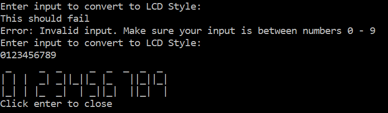

# Clock Challenge

### How to run project
To run, click download and open the .sln file. You will need Visual Studio and .NetFramework to open and run this project.

### What is this project?
This project was a placement exercise that was set as part of FDM Junior Developer assessment day. The goal is to allow users to input whole numbers, which is then displayed in an LCD style format, similar to digital clocks. I had also created an email explaning the solution . This was created within a time limit of 1 hour 30 minutes.

### Project sample output

